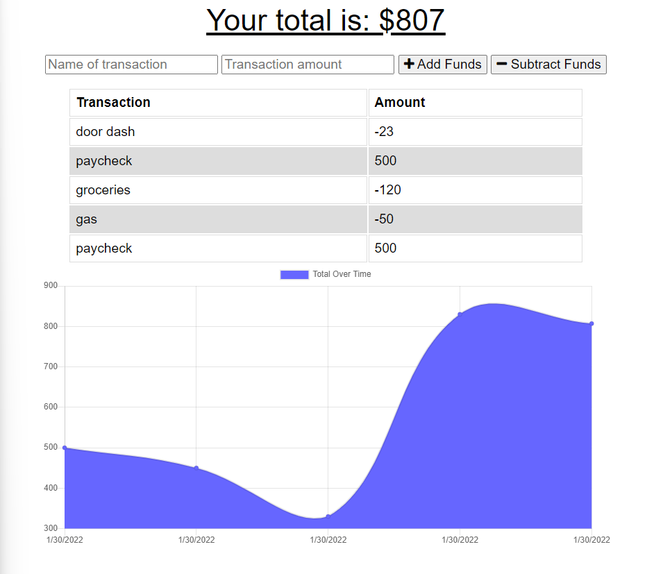

# Budget Tracker

## Description
    An easy and intuitive app to keep track of your expenses and income.
  ## Table of Contents
  *[Installation](#installation)

  *[Usage](#usage)

  *[Links](#links)

  ## Installation
    This application requires express.js, mongoose, and mongoDB. The PWA application can be downloaded straight to your computer or mobile device.

  ## Usage
  Simply enter the amount of the transaction and the name of transaction then choose whether the funds need to be added or subtracted and a table and graph of your transaction history is produced. The app can be downloaded for mobile devices and works without internet connection. 
  

  ## Links

  [GitHub](https://github.com/Dustin2400/budget-tracker)

  [Heroku](https://frozen-eyrie-72495.herokuapp.com)

##
  Made with ❤️ by Dustin Grijalva